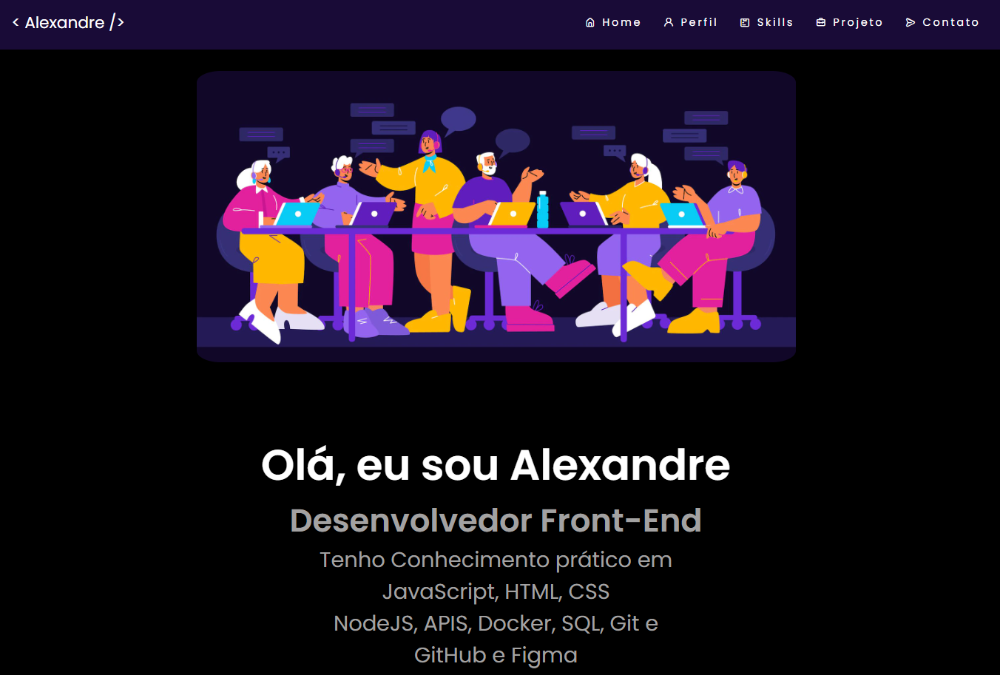

  <h1> Portfolio </h1>

 

 #
  <h2 align="center">
  Ola👋 
  Sou Alexandre seja Bem vindo 
  Espero que Goste 😎
  </h2> 
  
  
  
    
  <h3 align="center">
  Criei esse portfolio com base no meu 
  conhecimento e aprendizado 

  Estou ingressando na área de <strong>Front-End</strong> 
  procurando uma vaga de Emprego para 
  Júnior ou Estágio 
</h3>   

<h2 align="center">
  <strong>Conhecimento Prático</strong> 

  
  
  
  

  
  
  

</h2>

<h3 align="center"> No Momento estou estudando sobre <strong>React</strong>  e <strong>TypeScript</strong>

#
<h2 align="center">

[Clique aqui para acessar](https://allesoares95.github.io/projeto-portifolio)

Qualquer duvida entre em contato 

  

</h2> 
